# WebSacrapMiniProjec

# Sujetadores de mercadillo

## Un estudio al vuelo para demostrar mis capacidades de obtención de información cruda de la web, entretenimiento del auditorio y conclusiones razonadas en la materia. 

# Objetivo
El objetivo es la utilización de la librería Selenium de Python para sacar la información de páginas web. Esto tiene aplicación en infinidad de campos, pero yo lo he querido orientar hacia un estudio de mercado de un producto concreto.

​

### El producto escogido ha sido los sujetadores. En un principio había comenzado con electrodomésticos, concretamente lavadoras, pero dado que es un trabajo voluntario he decido cambiar de tercio y ofrecer un producto que guste a todo el mundo.
He elegido echar un vistazo a la sección de sujetadores de:

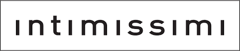

​
# Working plan 
​

​1. Conseguir hacer funcionar el driver de Selenium de manera artesanal. 
2. Aceptado de cookies.

3. Selección de información a almacenar.

4. Bucles para enriquecimiento de listas de diccionarios.

5. Creación de DataFrame.

6. Limpieza y transformación de columnas a numéricas.

7. Visualización de datos.

8. Exposición de los mismos en este documento.

​
### Estructura del proyecto
El proyecto se ha realizado íntegramente en un cuaderno de júpiter:

a) **WebScra.ipynb**

b) **/images** --> Carpeta almacen de figuras e imagenes

c) **Archivos Extra** --> Driver de Selenium.exe, carpeta de Seleinum, figuras y csv generado y fotos de las prendas 

## Análisis y visualización de los datos obtenidos
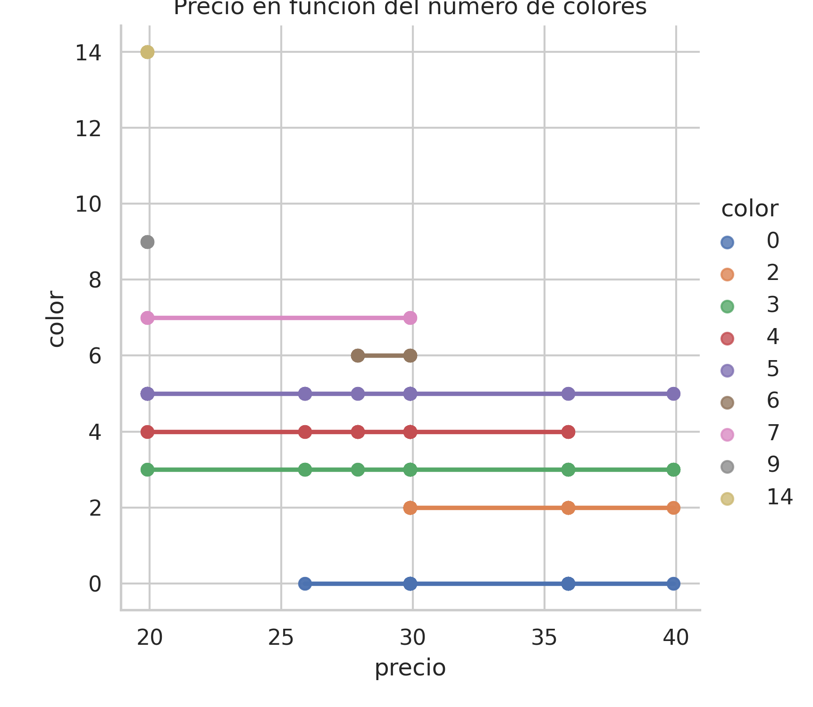

Se observa tendencia al alza de los precios a medida que se reduce el numero de colores disponibles.
Podemos ver la tendencia en la siguiente gráfica.
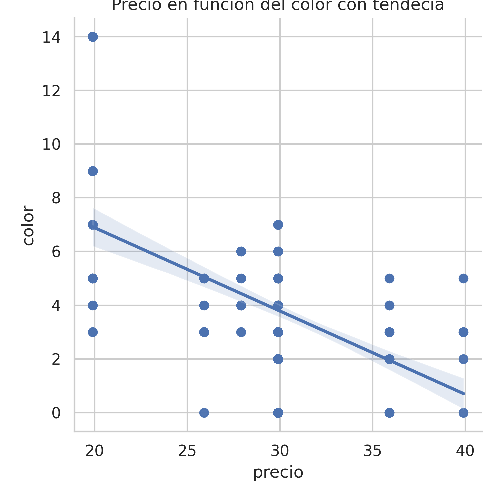

De esta evidencia podemos inferir que sujetadores que ofertan mas colores suelen ser mas baratos.
El precio mínimo de los sujetadores de la web de esta empresa es de 19.99 euros. Ofreciendo a este precio justo 58 modelos.
##Estos tres son una muestra del la gama de 19.99 

##Líneas simples

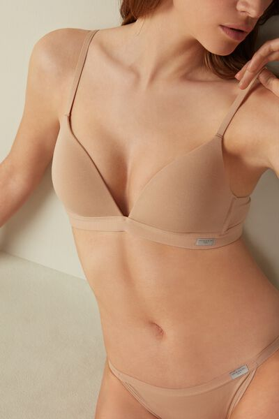

## Sin texturizado

La gran masa de la industria del sujetador en esta empresa se encuentra en la gama media.
Esta afirmación la hago considerando gama media los sujetadores de 29.99 euros. La empresa ofrece un total de 166 modelos.
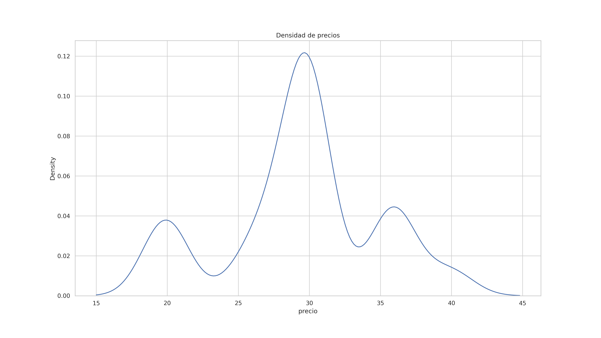

Se visualiza claramente que en la zona central se encuentra la mayor parte de negocio de la empresa.
En este sector de la oferta el numero de colores se encuentra contenido entre 6 y 2 

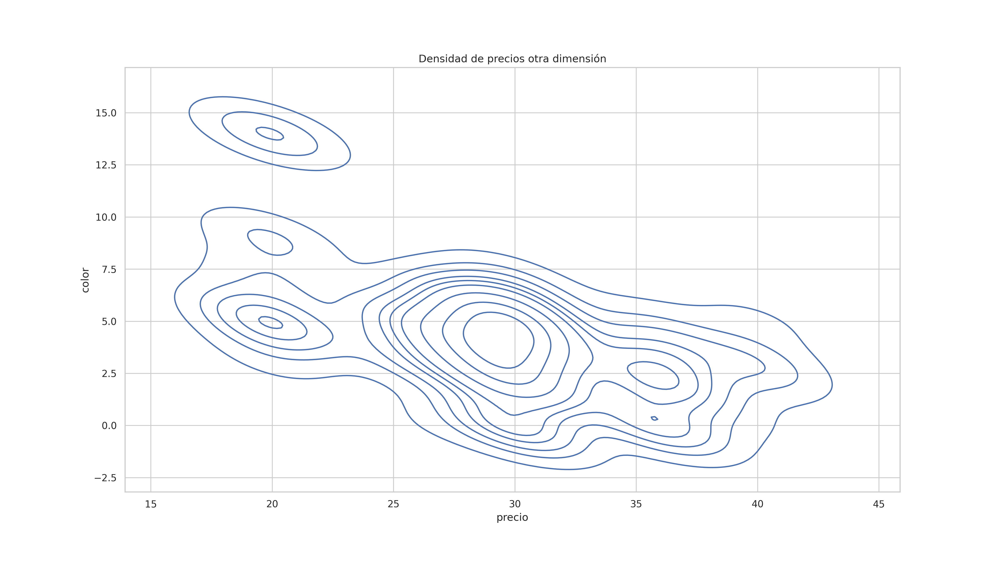
##Estos tres son una muestra del la gama media de 29.99 

## Aumento leve de la complejidad de las formas

## Transparencias y texturas

El tercer trozo del pastel del mercado en el que la empres posiciona sus sujetadores lo he considerados la gama media.
Considerando gama alta los sujetadores de 39.99 euros. La empresa ofrece un total de 19 modelos a este precio.
Aunque de la siguiente gráfica se puede observar que hay un rango de productos mayores en precio a 35 euros 
que supone una densidad mayor incluso que la gama baja.
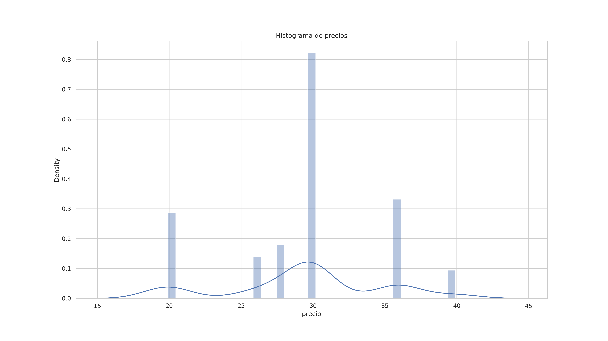

Se visualiza claramente que en la zona central se encuentra la mayor parte de negocio de la empresa.
En este sector de la oferta el numero de colores se encuentra contenido entre 6 y 2 

##Estos tres son una muestra del la gama más alta de 39.99 

##Formas mas exigentes y favorecedoras

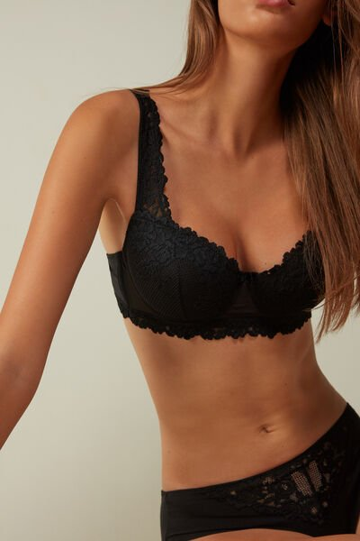

## Textura superior y FANTASÍA!!!

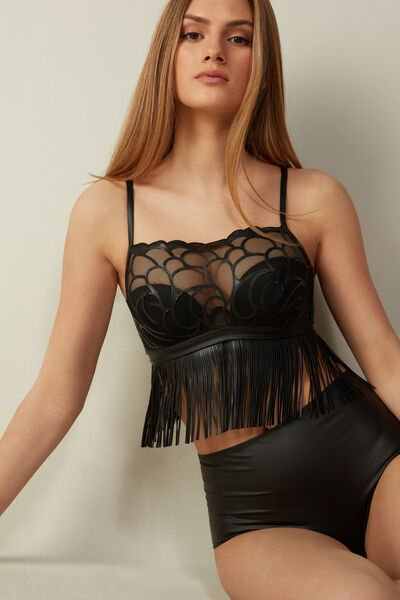

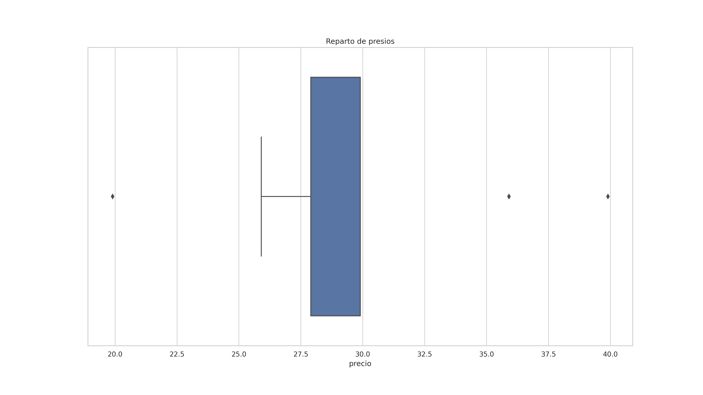

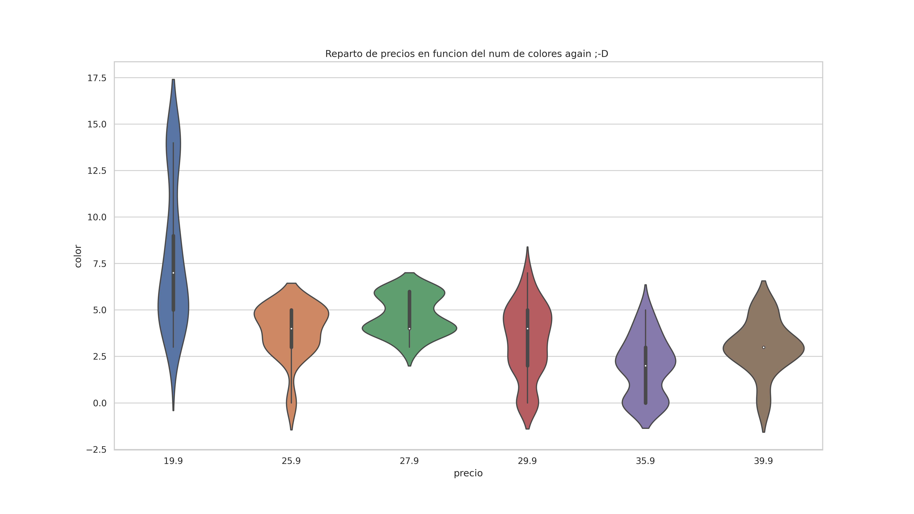

# Libraries
​

[sys](https://docs.python.org/3/library/sys.html)

​

[requests](https://pypi.org/project/requests/2.7.0/)

​

[pandas](https://pandas.pydata.org/)

​

[Seleium](https://selenium-python.readthedocs.io/)

​

[Seaborn](https://seaborn.pydata.org/)

​

[urllib](https://docs.python.org/3/library/urllib.html)