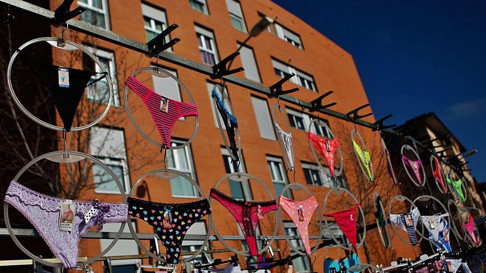
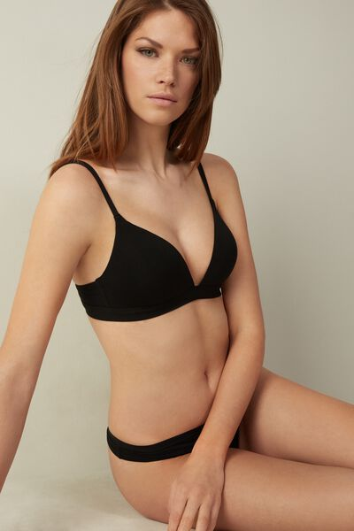
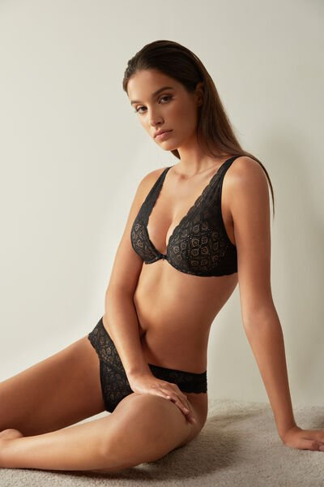
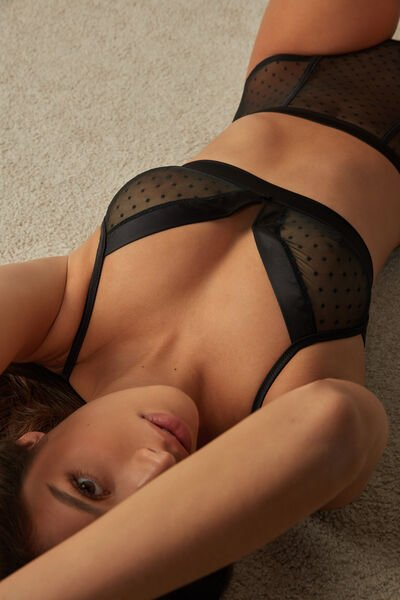
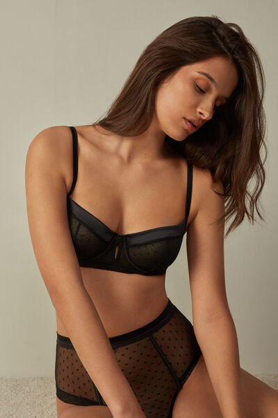
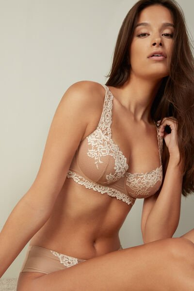
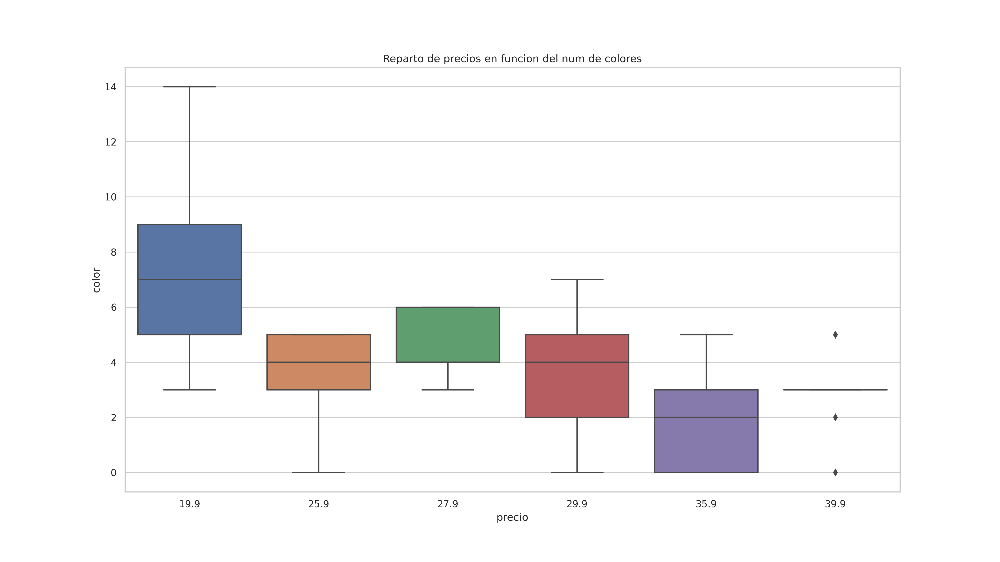

# WebSacrapMiniProjec

# Sujetadores de mercadillo

## Un estudio al vuelo para demostrar mis capacidades de obtención de información cruda de la web, entretenimieto del auditorio y conclusiones razonadas en la materia. 

# Objetivo
El objetivo es la utilizacion de la librería Selenium de Python para sacar la información de paginas web. Esto tiene aplicacion en infinidad de campos, pero yo lo he querido orientar hacia un estudio de mercado de un producto concreto.

​

### El producto escojido ha sido los sujetadores. En un principio habia comenzado con electrodomesticos, concretamente labadoras, pero dado que es un trabajo voluntario he decido cambiar de tercio y ofrecer un producto que guste a todo el mundo.
He elegido echar un vistazo a la secion de sujetadores de:

​

 1. The investors want the company headquarter in Madrid. The contacted a real state agency. They find an office for rent in every neighbourhood that fit the necessities and standards of the company. The give us a list of addresses. 
 2. In the web sector to be surrounded by companies that are in a similar sector to ours.
 3. With less than 50 employees, to be surrounded by small companies like us
 4. Created since 2007 to be surrounded by young companies. 
​
# Working plan 
​

​
1. Consegir hacer funcinar el driver de Selenium de manera artesanal. 
2. Aceptado de cookies.
3. Selecion de informacio a almacenar.
4. Bucles para enriquecimiento de listas de diccionarios.
5. Creacion de DataFrame.
6. Limpieza y transformacion de columnas a numéricas.
7. Visualizacion de datos.
8. Exposicion de los mismos en este documento.
​

​
### Estructura del proyecto
​
El proyecto se ha realizado integramente en un cuadreno de jupyter:

a) **WebScra.ipynb**

b) **/images** --> Carpeta almacen de figuras e imagenes

c) **Archivos Extra** --> Driver de Selenium.exe, carpeta de Seleinum, figuras y csv genreado y fotos de las prendas 

## Análisis y visualizacion de los datos obtenidos

Se observa tendencia al alza de los precios a medida que se reduce el numero de colores diponibles.
Podemos ver la tendecia en la sigiente gráfica.

De esta evidencia podemos inferir que sujetadores que ofertan mas colores suelen ser mas baratos.
El precio minimo de los sujetadores de la web de esta empresa es de 19.99 euros. Ofreciendo a este perecio justo 58 modelos.
##Estos tres son una muestra del la gama de 19.99 

##Lineas simples

## Sin texturizado

La gran masa de la industria del sujetador en esta empresa se encuentra en la gama media.
Esta afirmacion la hago cosiderando gama media los sujetadores de 29.99 euros. La empresa ofrece un total de 166 modelos.

Se visualiza claramente que en la zona central se encuentra la mayor parte de negocio de la empresa.
En este sector de la oferta el numero de colores se encuentra contenido entre 6 y 2 

##Estos tres son una muestra del la gama media de 29.99 

##Aumento leve de la complegidad de las formas

## Transparencias y texturas

El tercer trozo del pastel del mercado en el que la empres posiciona sus sujetadores lo he considerados la gama media.
Cosiderando gama alta los sujetadores de 39.99 euros. La empresa ofrece un total de 19 modelos a este precio.
Aunque de la siguiente gráfica se puede obserbar que hay un rango de productos mayores en precio a 35 euros 
que supone una desidad mayor incluso que la gama baja.

Se visualiza claramente que en la zona central se encuentra la mayor parte de negocio de la empresa.
En este sector de la oferta el numero de colores se encuentra contenido entre 6 y 2 

##Estos tres son una muestra del la gama más alta de 39.99 

##Formas mas exigentes y favorecedoras

## Textura superior y FANTASÍA!!!

# Libraries
​

[sys](https://docs.python.org/3/library/sys.html)

​

[requests](https://pypi.org/project/requests/2.7.0/)

​

[pandas](https://pandas.pydata.org/)

​

[Seleium](https://selenium-python.readthedocs.io/)

​

[Seaborn](https://seaborn.pydata.org/)

​

[urllib](https://docs.python.org/3/library/urllib.html)